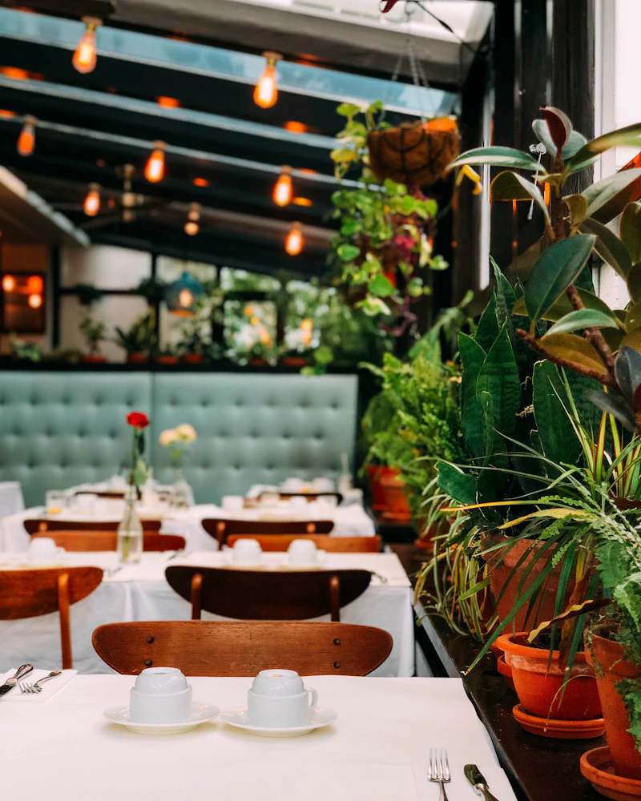

# The Harvest Table — Restaurant Website Template

A production-ready, multi-page restaurant website template built for Ontario restaurant clients. Pure HTML, CSS, and vanilla JavaScript — no frameworks, no build tools, no dependencies.

---

## What's Included

| File | Purpose |
|---|---|
| `index.html` | Home page — hero, about intro, featured dishes, testimonials, CTA |
| `menu.html` | Full menu with JS tab switcher (Starters / Mains / Desserts / Drinks) |
| `about.html` | Our Story — origin, chef profile, timeline, farm partners |
| `reservations.html` | Booking form with sidebar reservation info |
| `contact.html` | Contact details, hours, map placeholder, contact form |
| `404.html` | Not Found page |
| `styles.css` | Single shared stylesheet using CSS custom properties |
| `main.js` | Shared JS — nav, scroll reveal, parallax, menu tabs, forms |
| `README.md` | This file |

---

## Quick Start

1. Open any `.html` file directly in a browser — no server required for local preview.
2. Replace all placeholder content (name, address, phone, copy) with client details.
3. Swap photo placeholder `<div>` elements for real `` tags (see **Photo Swaps** below).
4. Wire up the contact and reservation forms to a backend (see **Forms** below).
5. Deploy to any static hosting provider.

---

## Customising for a New Client

### 1. Brand Identity

All colour tokens live in the `:root` block at the top of `styles.css`:

```css
:root {
  --charcoal: #1C1A17;       /* primary dark background */
  --parchment: #F2EAD9;      /* primary light / text */
  --terracotta: #C4622D;     /* accent / CTAs */
  --sage: #7A8C6E;           /* secondary accent */
  --off-black: #0F0E0C;      /* darkest background */
}
```

Edit only these five values — every colour across all six pages updates automatically.

### 2. Restaurant Details

Search and replace these strings across all HTML files:

| Placeholder | Replace With |
|---|---|
| `The Harvest Table` | Client restaurant name |
| `Where Ontario's Seasons Come to the Table` | Client tagline |
| `(647) 555-0183` | Client phone number |
| `88 Elmwood Avenue, Toronto, ON M6G 2K4` | Client address |
| `hello@harvesttable.ca` | Client email |
| `M6G 2K4` | Client postal code |
| `The Annex` | Client neighbourhood |
| `2024` | Current year |

### 3. Fonts

Fonts are loaded via Google Fonts in each `<head>`. The three font families used:

- **Playfair Display** — headings and display (`--font-display`)
- **Cormorant Garamond** — subheadings, labels, italic copy (`--font-sub`)
- **Lato** — body text and UI (`--font-body`)

To change fonts: update the Google Fonts `<link>` in each HTML file and the three `--font-*` variables in `styles.css`.

### 4. Menu Content

The menu is in `menu.html`. Each menu item follows this structure:

```html
<div class="menu-item">
  <div class="menu-item__info">
    <p class="menu-item__name">Dish Name</p>
    <p class="menu-item__desc">Brief description of ingredients and preparation</p>
  </div>
  <span class="menu-item__price">$00</span>
</div>
```

The drinks tab has a special wine item structure with glass and bottle pricing:

```html
<div class="menu-item menu-item--wine">
  <div class="menu-item__info">
    <p class="menu-item__name">Wine Name</p>
    <p class="menu-item__desc">Region VQA — tasting notes</p>
  </div>
  <div class="menu-item__price">
    <span class="price-glass">$00 / glass</span>
    <span class="price-bottle">$00 / bottle</span>
  </div>
</div>
```

### 5. Hours

Hours appear in two places:
- `reservations.html` — the `<table class="hours-table">` in the sidebar
- `contact.html` — the `.hours-grid` section

Update both.

---

## Photo Swaps

Every image area is a `<div class="photo-placeholder photo-placeholder--*">`. Search for `PHOTO SWAP INSTRUCTIONS` in any HTML file to find them.

To replace with a real photo:

```html
<!-- Before -->
<div class="photo-placeholder photo-placeholder--interior" role="img" aria-label="...">
  <!-- PHOTO SWAP INSTRUCTIONS: ... -->
  <div class="photo-placeholder__label">...</div>
</div>

<!-- After -->

```

**Recommended image sizes:**

| Location | Recommended size | Ratio |
|---|---|---|
| Hero background | 1920 × 1080px | 16:9 |
| Split section images | 800 × 1000px | 4:5 |
| Dish card images | 600 × 800px | 3:4 |
| Page hero backgrounds | 1920 × 800px | wide |
| Map image | 800 × 600px | 4:3 |

---

## Forms

Both forms (reservations and contact) use a `data-form` attribute to identify themselves. By default, they simulate a successful submission after 800ms.

### Wiring to a Real Backend

Open `main.js` and find the comment block inside `initForms()`. Three integration options are documented there:

**Option 1 — Formspree (recommended for most clients)**
1. Create a free account at formspree.io
2. Add your form endpoint as the `action` attribute on the `<form>` element
3. Remove the JS event listener for that form — Formspree handles it natively

**Option 2 — EmailJS**
Add the EmailJS SDK to the `<head>`, then call `emailjs.sendForm()` inside the submit handler.

**Option 3 — Custom API**
Replace the `setTimeout` demo block with a `fetch()` call to your backend endpoint.

---

## Adding a New Page

1. Copy the `<nav>`, `<footer>`, and `<script>` blocks from any existing page.
2. Wrap your content in `<main id="main-content">`.
3. Add the new page link to the `nav__links` `<ul>` on every page.
4. Add the new page link to both footer navigation lists.

---

## Scroll Reveal Animations

Add `.reveal` to any element to give it a fade-up-on-scroll entrance:

```html
<div class="reveal">Animates in on scroll</div>
```

Add staggered delays for grouped elements:

```html
<div class="reveal reveal--delay-1">First</div>
<div class="reveal reveal--delay-2">Second</div>
<div class="reveal reveal--delay-3">Third</div>
<div class="reveal reveal--delay-4">Fourth</div>
```

Driven by `IntersectionObserver` in `main.js` — no external libraries needed.

---

## Accessibility Notes

- All interactive elements have visible focus styles (`:focus-visible`)
- All images require meaningful `alt` text — do not leave them blank
- Form inputs are associated with `<label>` elements via `for`/`id`
- Nav uses `aria-expanded` for the mobile toggle
- Tab panel uses `role="tablist"`, `role="tab"`, `role="tabpanel"` with `aria-selected`
- Decorative elements carry `aria-hidden="true"`

---

## Deployment

This is a pure static site. Deploy to any of the following with zero configuration:

- **Netlify** — drag and drop the `restaurant-template/` folder
- **Vercel** — connect a GitHub repository or deploy via CLI
- **GitHub Pages** — push to a `gh-pages` branch
- **Squarespace / Wix** — not applicable; this is a custom-coded template
- **cPanel shared hosting** — upload via FTP to `public_html/`

No build step required. No npm. No node_modules.

---

## Ontario-Specific Customisation

This template was built for Ontario restaurant clients. The following elements reference Ontario conventions and should be updated per client:

- **AGCO licence notice** in every footer: update with client's actual AGCO licence number if desired, or remove the word "Licensed" if client does not serve alcohol
- **VQA wine references** in `menu.html`: update to reflect client's actual wine list
- **Ontario Craft Brewers** references: update to reflect client's actual beer selections
- **Farm sourcing regions** (Niagara Peninsula, Prince Edward County, Grey County): update to reflect client's actual sourcing, or remove if not applicable
- **Canadian English** is used throughout: colour, flavour, centre, neighbourhood, organisation — maintain this in all new copy

---

*Template built for independent Ontario restaurant clients. Resale and client customisation permitted.*
